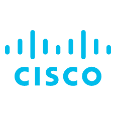

# Cisco Firepower Logic Apps connector

 
## Table of Contents

1. [Overview](#overview)
1. [Actions supported by Cisco Firepower custom connector](#actions)
1. [Deployment](#deployment)
1. [Authentication](#Authentication)

## Overview
General info about this product and the core values of this integration.  

## Actions supported by Cisco Firepower custom connector

| Component | Description |
| --------- | -------------- |
| **Generate token** | Use the configured basic authentication to start a session and get a token for other actions |
| **Refresh token** | After 30 minutes a generated token expires and can be renewed with this action |
| **Revoke access** | This action ends a session and revokes access for a token |
| **Retrieves list of all network group objects** | Action used to get all network group objects |
| **Retrieves the network group object associated with the specified ID** | Action used to get a specific network group object |
| **Create the network group object** | Action used to create a network group object |
| **Modifies the network group object associated with the specified ID** | Action used to modify a specific network group object |
| **Deletes the network group object associated with the specified ID** | Action used to delete a specific network group object |

## Deployment instructions 

Prior using this custom connector, it should be deployed in the Resource Group where the playbooks that will include it are located.
 
1. Deploy the Custom Connector by clicking on "Deploy to Azure" button. This will take you to deplyoing an ARM Template wizard.
2. Fill in the required paramteres:
    * Connector name: Please enter the custom connector(ex:Cisco Firepower connector)
    * Service Endpoint: The URL to the Cisco Firewall REST API

## Authentication
This connector supports the following authentication types:
* Basic Authentication
